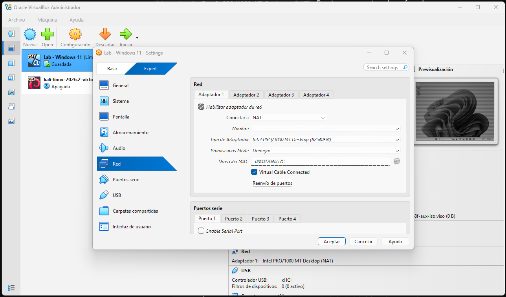
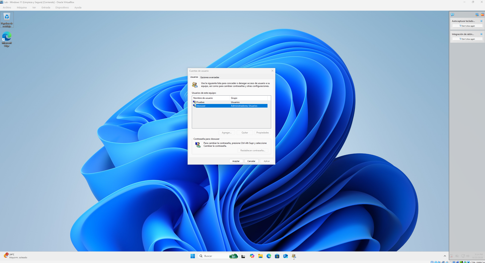
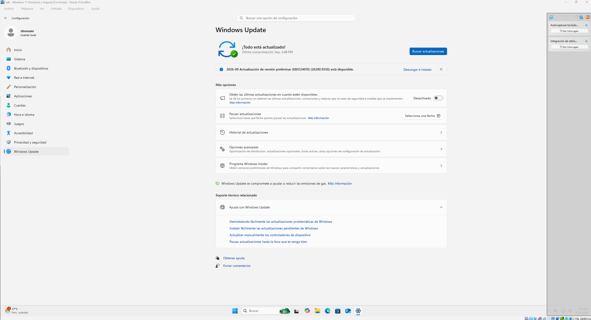
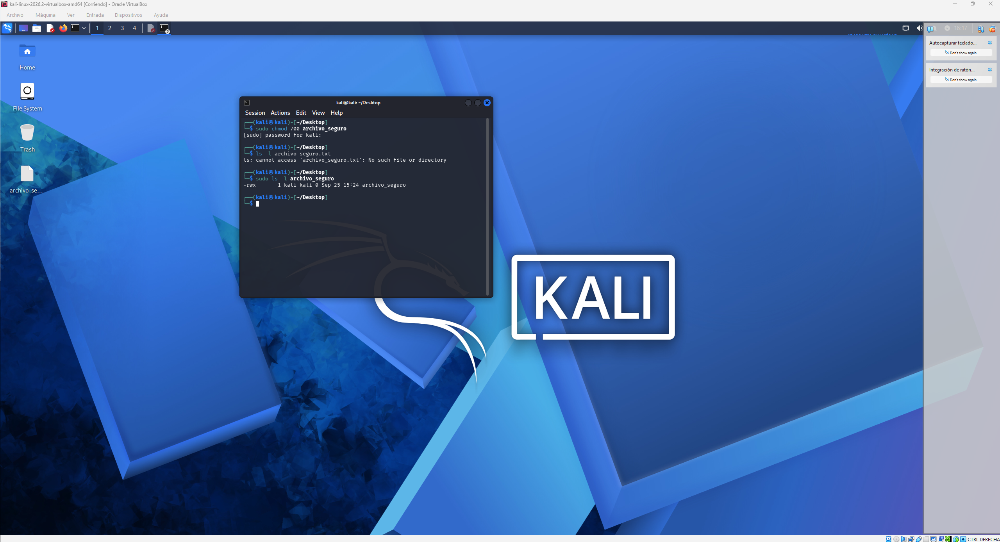
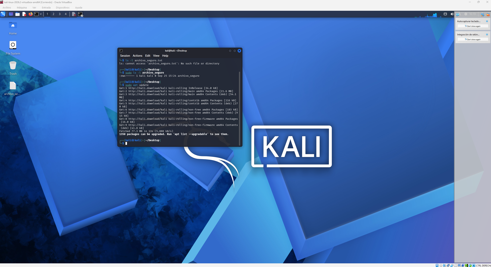
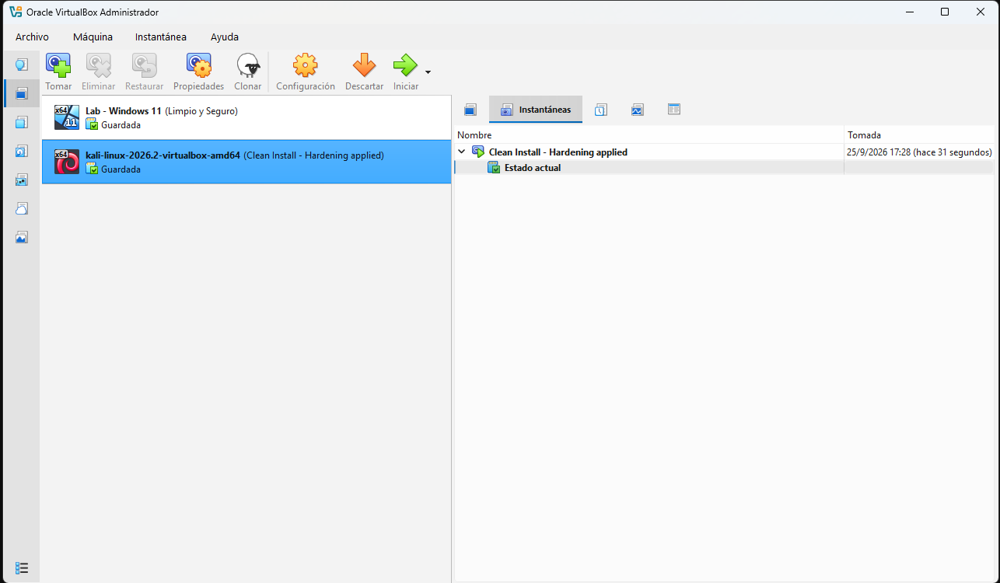

# laboratorio-ciberseguridad
# Reporte Técnico: Laboratorio Seguro de Ciberseguridad

## 1. La Fundación: VirtualBox y Red Aislada

### Evidencia de Configuración

### Justificación Técnica
Para este laboratorio se configuró la interfaz de red en modo **NAT (Network Address Translation)**. Se optó por esta modalidad ya que actúa como una capa de intermediación y aislamiento entre la máquina virtual y la red física del Host. 

A través de NAT, la máquina invitada tiene salida a Internet para descargar actualizaciones de seguridad, repositorios y paquetes esenciales, pero no permite conexiones entrantes no solicitadas desde la red local física hacia la VM. De esta forma, cualquier tráfico extraño, escaneo o eventual compromiso dentro del laboratorio queda contenido, evitando que impacte o se propague hacia la máquina real anfitriona y los demás dispositivos de la red.

## 2. Capa Windows: Usuarios y Actualizaciones

### Evidencia de Usuarios
.

### Evidencia de Windows Update
.

## 3. Capa Linux: Permisos y Gestión

### Evidencia Permisos Archivo_Seguro Kali

.

### Evidencia Updates Kali

## 4. La Red de Seguridad: Snapshot Inicial

### Evidencia Snapshot Clean Install - Hardening applied

